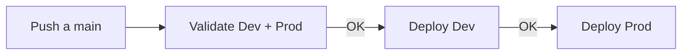
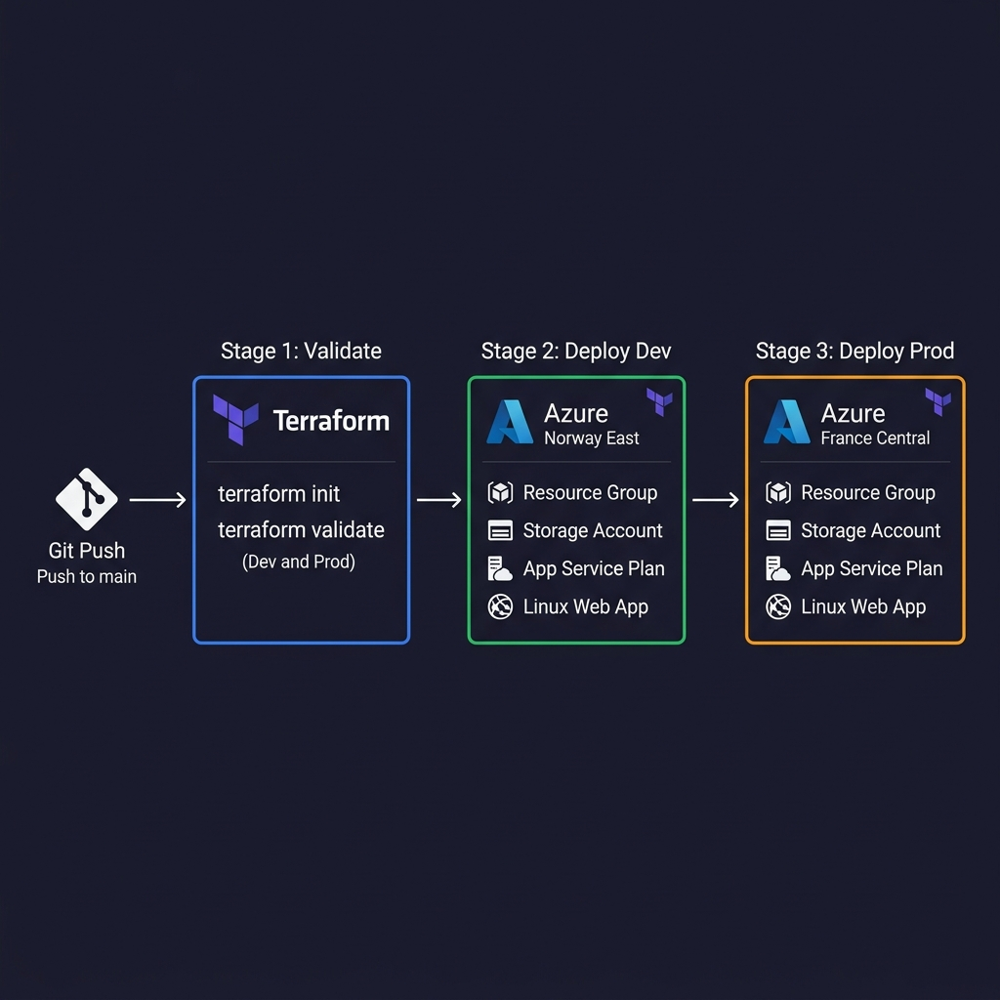

# Pipeline-antigravity-skills

Test de despliegue de infraestructura en Azure usando **Antigravity** (con skills orientadas a Azure), **Azure DevOps Pipelines** y **Terraform**.

El objetivo es sencillo: yo defino qué infraestructura necesito, en qué regiones desplegarla y con qué servicios (App Service, Storage, etc.), y Antigravity — usando skills específicas de Azure — se encarga de generar el código Terraform y el pipeline. La toma de decisiones es mía; la herramienta me ahorra tiempo en la escritura.

## Tecnologías

- **Terraform** — Infraestructura como código
- **Azure DevOps Pipelines** — CI/CD
- **Azure** — Proveedor cloud (App Service, Storage Account)
- **Antigravity** — Asistente IA con skills de Azure para generar la infra

## Estructura del proyecto

```
├── azure-pipelines.yml            # Pipeline CI/CD con 3 stages
└── infra/
    ├── envs/
    │   ├── dev/                    # Entorno de desarrollo (Norway East)
    │   └── prod/                   # Entorno de producción (France Central)
    └── modules/
        └── azure_web_app/          # Módulo reutilizable (RG + Storage + App Service)
```

## Cómo funciona el pipeline

El pipeline se dispara con un push a `main` o `master` y tiene 3 stages secuenciales:

1. **Validación** — Instala Terraform y ejecuta `terraform validate` en ambos entornos
2. **Deploy Dev** — Si la validación pasa, despliega la infra en Dev (Norway East)
3. **Deploy Prod** — Si Dev fue bien, despliega en Prod (France Central)

Cada stage de deploy usa `AzureCLI@2` con un Service Connection para autenticarse contra Azure.





## Qué se despliega

El módulo `azure_web_app` crea estos recursos por entorno:

| Recurso | Nombre | Detalle |
|---------|--------|---------|
| Resource Group | `rg-az400lab-{env}` | Contenedor de recursos |
| Storage Account | `staz400lab{env}{suffix}` | Standard / LRS |
| App Service Plan | `plan-az400lab-{env}` | Linux, F1 (gratis) |
| Linux Web App | `app-az400lab-{env}-{suffix}` | always_on = false |

El sufijo aleatorio de 6 caracteres se genera con `random_string` para evitar colisiones de nombres.

## Requisitos

- Cuenta de Azure con suscripción activa
- Proyecto en Azure DevOps con un Service Connection configurado (`Conexion-Lab-Azure-RG`)
- Antigravity con skills de Azure

## Sobre las skills de Antigravity

El código de Terraform y el pipeline fueron generados con ayuda de Antigravity usando skills orientadas a Azure. Estas skills permiten al asistente entender el contexto de los servicios de Azure y generar código de infraestructura adaptado (módulos, variables, outputs, pipelines YAML).

La carpeta `skills/` está en el `.gitignore` porque contiene las skills locales y no forma parte del código de infraestructura.

## Autor

Juan Pablo — [JuanPabloSp](https://github.com/JuanPabloSp)
